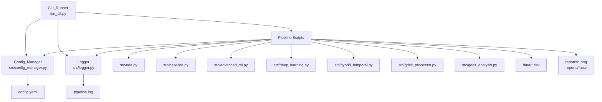

# Design Document: Codebase Improvements

## Overview

This design implements a comprehensive infrastructure upgrade for the Dynamic Trend & Event Detector pipeline. The system currently consists of seven Python scripts that process news headlines and GDELT data through various analytical techniques (EDA, TF-IDF, LDA, BERTopic, semantic velocity, and GDELT theme analysis).

The improvements focus on five key areas:

1. **Configuration Management**: Centralized YAML-based configuration replacing hard-coded magic numbers
2. **File Path Validation**: Robust error handling for missing files and malformed data
3. **Structured Logging**: Multi-level logging framework replacing print statements
4. **CLI Flexibility**: Enhanced run_all.py with selective script execution
5. **Unit Testing**: Automated test suite for core analytical functions

These changes maintain backward compatibility with existing analytical logic while significantly improving maintainability, debuggability, and production readiness.

## Architecture

### High-Level Component Diagram



### Execution Flow

1. User invokes `run_all.py` with optional CLI arguments (--only, --skip, --config)
2. CLI_Runner parses arguments and validates configuration
3. Config_Manager loads config.yaml and provides default values for missing keys
4. Logger initializes with console and file handlers
5. CLI_Runner executes selected scripts in sequence
6. Each script:
   - Retrieves configuration from Config_Manager
   - Validates input file existence
   - Logs execution progress
   - Handles errors gracefully with structured logging
   - Produces outputs to reports/
7. CLI_Runner logs execution summary with timing information

### Design Principles

- **Separation of Concerns**: Configuration, logging, and business logic are decoupled
- **Fail-Fast with Clear Messages**: File validation happens before processing
- **Backward Compatibility**: Existing scripts continue to work with minimal changes
- **Testability**: Core functions are isolated and mockable
- **Progressive Enhancement**: Each improvement can be deployed independently

## Components and Interfaces

### 1. Config_Manager

**Location**: `src/config_manager.py`

**Responsibility**: Load and provide configuration values from YAML file with fallback defaults.

**Interface**:

```python
class ConfigManager:
    def __init__(self, config_path: str = 'config.yaml'):
        """Load configuration from YAML file."""
        
    def get(self, section: str, key: str, default: Any = None) -> Any:
        """Retrieve configuration value with fallback to default."""
        
    def get_section(self, section: str) -> dict:
        """Retrieve entire configuration section."""
        
    def validate(self) -> bool:
        """Validate configuration structure and required keys."""
```

**Usage Example**:

```python
from src.config_manager import ConfigManager

config = ConfigManager()
num_topics = config.get('advanced_ml', 'num_topics', default=5)
max_features = config.get('baseline', 'max_features', default=1000)
```

**Error Handling**:
- If config.yaml is missing, log warning and use all defaults
- If YAML is malformed, log error with parsing details and exit
- If a section/key is missing, return provided default value

### 2. Logger

**Location**: `src/logger.py`

**Responsibility**: Provide structured logging with multiple severity levels to console and file.

**Interface**:

```python
import logging

def setup_logger(name: str, log_file: str = 'pipeline.log', level: int = logging.INFO) -> logging.Logger:
    """Configure and return a logger instance."""
    
def get_logger(name: str) -> logging.Logger:
    """Retrieve existing logger by name."""
```

**Log Format**:
```
2024-01-15 14:32:01 | INFO | src.eda | Starting EDA analysis
2024-01-15 14:32:05 | ERROR | src.baseline | FileNotFoundError: data/news_headlines.csv not found
```

**Usage Example**:

```python
from src.logger import setup_logger

logger = setup_logger(__name__)
logger.info("Processing started")
logger.error("Failed to load file", exc_info=True)
```

### 3. File Validation Utilities

**Location**: `src/utils.py`

**Responsibility**: Validate file existence and handle common data quality issues.

**Interface**:

```python
def validate_file_exists(file_path: str, logger: logging.Logger) -> bool:
    """Check if file exists and log error if missing."""
    
def safe_read_csv(file_path: str, logger: logging.Logger, **kwargs) -> pd.DataFrame | None:
    """Read CSV with existence validation and error handling."""
    
def handle_null_text(df: pd.DataFrame, column: str, default: str = '') -> pd.DataFrame:
    """Replace null/empty values in text column with default."""
```

**Usage Example**:

```python
from src.utils import safe_read_csv, handle_null_text

df = safe_read_csv('data/news_headlines.csv', logger)
if df is not None:
    df = handle_null_text(df, 'headline_text')
```

### 4. Enhanced CLI_Runner

**Location**: `run_all.py` (modified)

**Responsibility**: Execute pipeline scripts with selective filtering and progress tracking.

**CLI Arguments**:

```bash
python run_all.py                              # Run all scripts
python run_all.py --only eda,baseline          # Run only specified scripts
python run_all.py --skip deep_learning         # Skip specified scripts
python run_all.py --config custom_config.yaml  # Use alternate config file
```

**Interface** (internal):

```python
def parse_arguments() -> argparse.Namespace:
    """Parse CLI arguments."""
    
def filter_scripts(all_scripts: list, args: argparse.Namespace) -> list:
    """Apply --only and --skip filters to script list."""
    
def run_script_with_timing(script_path: str, logger: logging.Logger) -> tuple[bool, float]:
    """Execute script and return (success, duration)."""
    
def print_summary(results: list[dict], logger: logging.Logger):
    """Display execution summary with timing information."""
```

### 5. Test Suite

**Location**: `tests/` directory

**Structure**:
```
tests/
├── __init__.py
├── test_gdelt_processor.py
├── test_hybrid_temporal.py
├── test_baseline.py
└── test_utils.py
```

**Testing Framework**: pytest with unittest.mock for file I/O mocking

**Key Test Classes**:

```python
# tests/test_gdelt_processor.py
class TestThemeExtraction:
    def test_extract_themes_valid_input()
    def test_extract_themes_empty_input()
    def test_extract_themes_malformed_input()

class TestToneExtraction:
    def test_extract_tone_valid_input()
    def test_extract_tone_missing_input()
    def test_extract_tone_invalid_format()

# tests/test_hybrid_temporal.py
class TestSemanticVelocity:
    def test_velocity_calculation_with_mock_vectors()
    def test_velocity_single_week()
    def test_velocity_identical_weeks()

# tests/test_baseline.py
class TestTFIDFRanking:
    def test_top_terms_extraction()
    def test_empty_corpus_handling()
```

## Data Models

### Configuration Schema (config.yaml)

```yaml
# Global settings
global:
  random_seed: 42
  stop_words_language: 'english'
  reports_dir: 'reports'
  data_dir: 'data'

# EDA configuration
eda:
  temporal_plot_filename: 'eda_temporal_dist.png'
  text_stats_filename: 'eda_text_stats.png'
  histogram_bins: 20
  figure_width: 12
  figure_height: 6

# Baseline TF-IDF configuration
baseline:
  max_features: 1000
  top_n_terms: 10
  max_df: 1.0
  min_df: 1

# Advanced ML (LDA) configuration
advanced_ml:
  num_topics: 5
  max_iter: 5
  learning_method: 'online'
  max_df: 0.95
  min_df: 2
  top_words_per_topic: 10

# Deep Learning (BERTopic) configuration
deep_learning:
  min_topic_size: 10
  nr_topics: 'auto'

# Hybrid Temporal configuration
hybrid_temporal:
  max_features: 5000
  time_bucket: 'W'  # Weekly buckets
  output_filename: 'semantic_velocity.csv'

# GDELT Processor configuration
gdelt_processor:
  input_pattern: '*.gkg.csv'
  output_filename: 'gdelt_processed.csv'
  encoding: 'utf-8'
  separator: '\t'

# GDELT Analysis configuration
gdelt_analysis:
  top_n_themes: 15
  output_filename: 'gdelt_top_themes.png'
  figure_width: 12
  figure_height: 8
```

### Logger Configuration

```python
# Logging levels
LOG_LEVELS = {
    'DEBUG': logging.DEBUG,
    'INFO': logging.INFO,
    'WARNING': logging.WARNING,
    'ERROR': logging.ERROR
}

# Log format
LOG_FORMAT = '%(asctime)s | %(levelname)s | %(name)s | %(message)s'
DATE_FORMAT = '%Y-%m-%d %H:%M:%S'
```

### Script Execution Result

```python
@dataclass
class ScriptResult:
    script_name: str
    success: bool
    duration: float  # seconds
    error_message: str | None = None
```

## Implementation Approach

### Phase 1: Infrastructure Components (Non-Breaking)

1. **Create Config_Manager**
   - Implement YAML loading with PyYAML
   - Add default value fallback logic
   - Create config.yaml with all current magic numbers documented

2. **Create Logger**
   - Set up dual handlers (console + file)
   - Configure formatting with timestamps
   - Add convenience function for script-level logger creation

3. **Create File Validation Utilities**
   - Implement validate_file_exists()
   - Implement safe_read_csv() wrapper
   - Add null/empty text handling

### Phase 2: Script Migration (Incremental)

For each script (eda.py, baseline.py, etc.):

1. Add Config_Manager import and initialization
2. Replace print() with logger calls
3. Replace magic numbers with config.get() calls
4. Add file validation before pd.read_csv()
5. Add try-except blocks with structured error logging
6. Test script independently

**Migration Priority**:
1. gdelt_processor.py (most error-prone due to external data)
2. eda.py (entry point for most analyses)
3. baseline.py, advanced_ml.py, hybrid_temporal.py
4. deep_learning.py (already has try-except)
5. gdelt_analysis.py

### Phase 3: CLI Enhancement

1. Add argparse to run_all.py
2. Implement --only and --skip filtering logic
3. Add timing instrumentation with time.perf_counter()
4. Implement progress indicators (e.g., "Running 3/7: src/baseline.py")
5. Create execution summary table

### Phase 4: Test Suite

1. Set up pytest configuration
2. Write tests for gdelt_processor (theme/tone extraction)
3. Write tests for hybrid_temporal (semantic velocity)
4. Write tests for baseline (TF-IDF ranking)
5. Write tests for utils (file validation)
6. Add test coverage reporting

### Backward Compatibility Strategy

- All changes are additive (no function signature changes)
- Scripts can still be run independently: `python src/eda.py`
- If config.yaml is missing, defaults match current hard-coded values
- Existing data files and output formats remain unchanged

### Rollback Plan

Each phase can be rolled back independently:
- Phase 1: Remove new files (config_manager.py, logger.py, utils.py)
- Phase 2: Revert individual script changes via git
- Phase 3: Revert run_all.py to original version
- Phase 4: Remove tests/ directory


## Correctness Properties

*A property is a characteristic or behavior that should hold true across all valid executions of a system—essentially, a formal statement about what the system should do. Properties serve as the bridge between human-readable specifications and machine-verifiable correctness guarantees.*

### Property 1: Configuration Loading Round Trip

*For any* valid YAML configuration file, loading it through Config_Manager and then retrieving values should return the values specified in the YAML file.

**Validates: Requirements 1.1**

### Property 2: Missing Configuration Fallback

*For any* section and key combination that does not exist in the loaded configuration, calling get() with a default value should return that default value without raising an exception.

**Validates: Requirements 1.3**

### Property 3: File Validation Before Processing

*For any* file path that does not exist on the filesystem, attempting to load it through safe_read_csv() should return None and log an error message containing the file path, without calling pd.read_csv().

**Validates: Requirements 2.1, 2.2**

### Property 4: Null Text Handling Robustness

*For any* DataFrame with a text column containing null, NaN, or empty string values, applying handle_null_text() should produce a DataFrame with no null values in that column and no exceptions raised.

**Validates: Requirements 2.3**

### Property 5: Malformed GDELT Data Defaults

*For any* malformed V2THEMES or TONE string (including null, empty, or improperly formatted values), the extraction functions should return default values (empty list for themes, 0.0 for tone) without raising exceptions.

**Validates: Requirements 2.5**

### Property 6: Error Logging Includes Exception Details

*For any* exception that occurs during script execution, logging it at ERROR level should produce a log entry containing the exception type, message, and stack trace.

**Validates: Requirements 3.4**

### Property 7: Log Format Completeness

*For any* log message written at any severity level, the resulting log entry should contain a timestamp, the log level name, the source module name, and the message text.

**Validates: Requirements 3.6**

### Property 8: CLI Only Filter Execution

*For any* subset of valid script names provided via --only argument, executing the CLI_Runner should run exactly those scripts and no others.

**Validates: Requirements 4.1**

### Property 9: CLI Skip Filter Execution

*For any* subset of valid script names provided via --skip argument, executing the CLI_Runner should run all scripts except those specified.

**Validates: Requirements 4.2**

### Property 10: Execution Summary Completeness

*For any* sequence of scripts executed by CLI_Runner, the final summary should include an entry for each script with its name, success status, and execution duration.

**Validates: Requirements 4.5**

### Property 11: Alternate Config File Loading

*For any* valid YAML file path provided via --config argument, the CLI_Runner should load configuration from that file instead of the default config.yaml.

**Validates: Requirements 4.6**

### Property 12: Output CSV Structure Consistency

*For any* execution of gdelt_processor that produces gdelt_processed.csv, the output file should contain exactly the columns: GKGRECORDID, DATE, SOURCECOMMONNAME, DOCUMENTIDENTIFIER, theme_list, tone_value.

**Validates: Requirements 5.6**

### Property 13: Visualization Function Robustness

*For any* visualization function (EDA plots, GDELT theme plots) executed with valid input data, the function should create the specified output file without raising exceptions.

**Validates: Requirements 5.7**

## Error Handling

### Error Categories and Strategies

#### 1. Configuration Errors

**Missing config.yaml**:
- Severity: WARNING
- Action: Log warning, use all default values, continue execution
- Rationale: System should be usable without configuration file

**Malformed YAML**:
- Severity: ERROR
- Action: Log error with parsing details, exit with code 1
- Rationale: Malformed config indicates user error that must be corrected

**Missing configuration key**:
- Severity: DEBUG
- Action: Log debug message, return default value, continue execution
- Rationale: Partial configuration is valid, defaults handle missing keys

#### 2. File System Errors

**Missing input data file**:
- Severity: ERROR
- Action: Log error with expected path, skip script, continue pipeline
- Rationale: One script failure shouldn't halt entire pipeline

**Missing output directory**:
- Severity: INFO
- Action: Create directory, log creation, continue execution
- Rationale: Output directories can be auto-created

**Permission errors**:
- Severity: ERROR
- Action: Log error with file path and permission details, exit script
- Rationale: Permission issues require user intervention

#### 3. Data Quality Errors

**Null/empty text values**:
- Severity: WARNING
- Action: Replace with empty string or default, log count of replacements
- Rationale: Data cleaning should be transparent but not fatal

**Malformed GDELT data**:
- Severity: WARNING
- Action: Use default values (empty list, 0.0), log malformed record count
- Rationale: External data quality issues shouldn't crash pipeline

**Empty DataFrame after filtering**:
- Severity: WARNING
- Action: Log warning, skip analysis, continue to next script
- Rationale: Edge case that may occur with small datasets

#### 4. CLI Argument Errors

**Conflicting arguments (--only and --skip)**:
- Severity: ERROR
- Action: Log error explaining conflict, print usage help, exit with code 2
- Rationale: User error that must be corrected before execution

**Invalid script names**:
- Severity: ERROR
- Action: Log error listing invalid names and valid options, exit with code 2
- Rationale: Typos should be caught before execution starts

**Invalid config file path**:
- Severity: ERROR
- Action: Log error with provided path, exit with code 1
- Rationale: Explicit config path that doesn't exist indicates user error

### Error Recovery Mechanisms

1. **Graceful Degradation**: Scripts continue with defaults when non-critical resources are missing
2. **Script Isolation**: One script failure doesn't prevent subsequent scripts from running
3. **Detailed Error Messages**: All errors include actionable information (file paths, expected formats)
4. **Exit Codes**: Different exit codes for different error categories aid automation

### Error Logging Format

```python
# Example error log entries
logger.error(
    "Failed to load data file",
    extra={
        'file_path': file_path,
        'error_type': type(e).__name__,
        'error_message': str(e)
    },
    exc_info=True
)
```

## Testing Strategy

### Dual Testing Approach

This project employs both unit testing and property-based testing to achieve comprehensive coverage:

- **Unit Tests**: Validate specific examples, edge cases, and integration points
- **Property Tests**: Verify universal properties hold across randomized inputs

Both approaches are complementary and necessary. Unit tests catch concrete bugs in specific scenarios, while property tests verify general correctness across a wide input space.

### Property-Based Testing Framework

**Library**: Hypothesis (Python property-based testing library)

**Configuration**:
- Minimum 100 iterations per property test (due to randomization)
- Each property test references its design document property via comment tag
- Tag format: `# Feature: codebase-improvements, Property {number}: {property_text}`

**Example Property Test**:

```python
from hypothesis import given, strategies as st
import pytest

# Feature: codebase-improvements, Property 2: Missing Configuration Fallback
@given(
    section=st.text(min_size=1, max_size=20),
    key=st.text(min_size=1, max_size=20),
    default=st.one_of(st.integers(), st.floats(), st.text())
)
def test_missing_config_returns_default(section, key, default):
    """For any section/key not in config, get() should return the default."""
    config = ConfigManager('tests/fixtures/minimal_config.yaml')
    # Ensure section/key doesn't exist
    if config.get(section, key) is None:
        result = config.get(section, key, default=default)
        assert result == default
```

### Unit Testing Strategy

**Framework**: pytest

**Test Organization**:
```
tests/
├── conftest.py                 # Shared fixtures
├── fixtures/
│   ├── minimal_config.yaml     # Minimal valid config
│   ├── sample_headlines.csv    # Small test dataset
│   └── sample_gdelt.csv        # Sample GDELT data
├── test_config_manager.py      # Config loading tests
├── test_logger.py              # Logging functionality tests
├── test_utils.py               # File validation tests
├── test_gdelt_processor.py     # GDELT parsing tests
├── test_hybrid_temporal.py     # Semantic velocity tests
├── test_baseline.py            # TF-IDF tests
└── test_cli_runner.py          # CLI argument tests
```

**Key Unit Test Categories**:

1. **Configuration Tests** (test_config_manager.py):
   - Load valid YAML with all sections
   - Load minimal YAML with missing sections
   - Handle malformed YAML gracefully
   - Retrieve specific known keys (num_topics, max_features, etc.)
   - Return defaults for missing keys

2. **Logging Tests** (test_logger.py):
   - Log at each severity level (DEBUG, INFO, WARNING, ERROR)
   - Verify console output contains log messages
   - Verify pipeline.log file contains log messages
   - Verify log format includes timestamp, level, module
   - Verify exception logging includes stack trace

3. **File Validation Tests** (test_utils.py):
   - Validate existing file returns True
   - Validate non-existent file returns False and logs error
   - safe_read_csv() with valid file returns DataFrame
   - safe_read_csv() with missing file returns None
   - handle_null_text() replaces nulls with defaults

4. **GDELT Processing Tests** (test_gdelt_processor.py):
   - Extract themes from valid V2THEMES string
   - Extract themes from empty/null V2THEMES returns empty list
   - Extract themes from malformed V2THEMES returns empty list
   - Extract tone from valid TONE string
   - Extract tone from empty/null TONE returns 0.0
   - Extract tone from malformed TONE returns 0.0
   - Output CSV has correct columns

5. **Semantic Velocity Tests** (test_hybrid_temporal.py):
   - Calculate velocity between two different week centroids
   - Calculate velocity between identical weeks returns 0.0
   - Handle single week (no velocity calculation)
   - Output CSV has correct columns (week, velocity)

6. **TF-IDF Tests** (test_baseline.py):
   - Extract top N terms from corpus
   - Handle empty corpus gracefully
   - Verify term ranking is descending by score

7. **CLI Runner Tests** (test_cli_runner.py):
   - Parse --only argument correctly
   - Parse --skip argument correctly
   - Detect --only and --skip conflict
   - Parse --config argument correctly
   - Filter scripts based on --only
   - Filter scripts based on --skip
   - Generate execution summary with timing

### Mocking Strategy

**File I/O Mocking**:
```python
from unittest.mock import patch, mock_open

@patch('pandas.read_csv')
def test_safe_read_csv_calls_pandas(mock_read_csv):
    """Verify safe_read_csv calls pd.read_csv with correct path."""
    mock_read_csv.return_value = pd.DataFrame({'col': [1, 2, 3]})
    result = safe_read_csv('test.csv', logger)
    mock_read_csv.assert_called_once_with('test.csv')
    assert result is not None
```

**Subprocess Mocking** (for CLI runner tests):
```python
@patch('subprocess.run')
def test_run_script_captures_output(mock_run):
    """Verify script execution captures stdout/stderr."""
    mock_run.return_value = MagicMock(
        stdout="Script output",
        stderr="",
        returncode=0
    )
    success, duration = run_script_with_timing('src/eda.py', logger)
    assert success is True
    mock_run.assert_called_once()
```

### Test Coverage Goals

- **Line Coverage**: Minimum 80% for new code (config_manager, logger, utils)
- **Branch Coverage**: Minimum 70% for error handling paths
- **Property Test Iterations**: 100 per property test

### Continuous Integration

**Test Execution**:
```bash
# Run all tests
pytest tests/ -v

# Run with coverage
pytest tests/ --cov=src --cov-report=html

# Run only property tests
pytest tests/ -m property

# Run only unit tests
pytest tests/ -m "not property"
```

**CI Pipeline** (GitHub Actions example):
```yaml
- name: Run tests
  run: |
    pip install pytest pytest-cov hypothesis
    pytest tests/ --cov=src --cov-report=xml
    
- name: Upload coverage
  uses: codecov/codecov-action@v3
```

### Testing Priorities

1. **High Priority** (must have 100% coverage):
   - Config_Manager.get() with defaults
   - File validation logic
   - GDELT theme/tone extraction
   - CLI argument parsing

2. **Medium Priority** (should have >80% coverage):
   - Logger formatting
   - Error handling paths
   - Semantic velocity calculation
   - TF-IDF ranking

3. **Low Priority** (nice to have):
   - Visualization output verification
   - Progress indicator display
   - Log file rotation

### Test Data Management

**Fixtures**:
- Keep test data small (<100 rows for CSV fixtures)
- Use realistic but anonymized data
- Version control all fixtures in tests/fixtures/
- Document fixture structure in tests/README.md

**Generated Test Data**:
- Use Hypothesis strategies for property tests
- Generate edge cases (empty strings, nulls, extreme values)
- Ensure reproducibility with fixed random seeds

